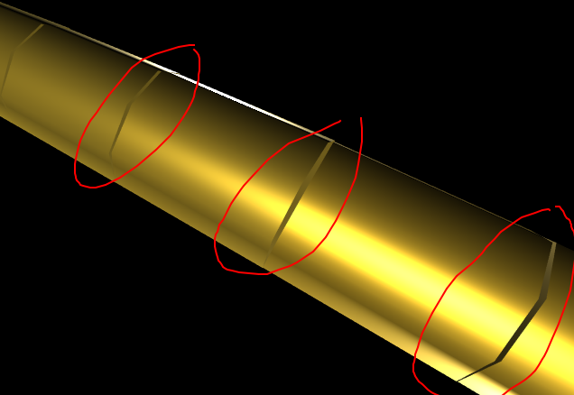
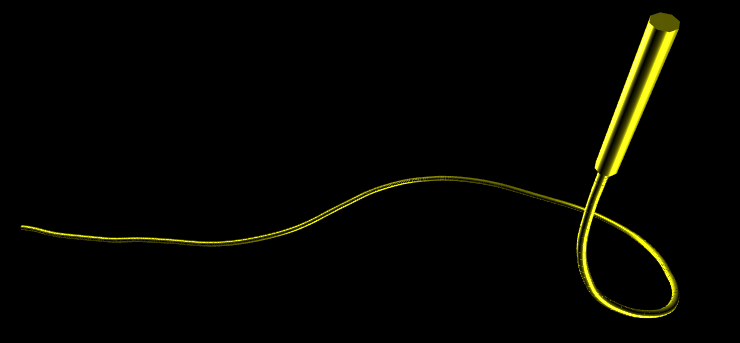

\tableofcontents{}
\newpage{}
# Abstract
# Sammendrag
Når man driller etter olje fra en flytende rigg eller et skip, så gynger platformen opp og ned på grunn av bølgene. Normalt blir røret regulert så det står stille selv om platformen/skipet går opp og ned. Men når man skal skru på nye rørsegmenter må røret holdes fast. 

Dette fører til at røret gynger opp og ned sammen med platformen, og blir som et stempel - som fører til store propagerende trykkendringer.

I midten av/ inne i brønnen har man det som kalles en pipe. Inne i pipen pumper man en væske nedover (borevæske) som går opp igjen på sidene og tar med seg stein, olje og gass. I riser/cased section har man metall rundt på utsiden der væsken kommer opp igjen, mens i "open hole" er det bare berggrunn rundt. Dersom trykket blir for høyt eller lavt kan det føre til at bergrunnen slår sprekker eller kollapser inn.

Heavelock har laget en simulator som kan forutsi hvor store trykkendringene langs hele brønnbanen vil bli basert på værforhold og andre paramtere. Hensikten med denne prosjektoppgaven er å visualisere disse simuleringsresultatene på en intuitiv måte - slik at hvem som helst kan forstå den.

Visualiseringen (i 3D) implementeres for nettlesere, kun ved hjelp av verktøy som er open-source/gratis å bruke. 


# Introduction
## Background: The Heave Problem
When drilling from a floating rig or drilling ship, the heaving motion of the floater causes major pressure fluctuations in the well when the drill pipe is in slips during connections. Pressure fluctuations in the order of 10-20 bars have been observed in practice, sometimes giving an unacceptable risk of mud loss or kick. The only remedy for the problem is to wait for wind and waves to subside. There is a potential for saving time and cost by obtaining accurate information about downhole conditions on which to base the decision to wait or drill forward. HeaveLock has developed a simulator that predicts downhole pressure fluctuations based on weather information, response amplitude operator of the rig, well geometry, fluid properties etc. The simulator produces a large amount of data and the data needs to be visualized to the user in an easy way. In this project work, the objective is to visualize simulator data for a chosen well by developing a web-based interface.

### HeaveSIM functionality (Heavelock's simulator)
The simulator itself will be viewed mostly as a black box in this project work. The main objective is to visualize the pressure-data along the well path for a chosen well and simulation point. The simulator itself takes a well geometry, fluid properties, weather conditions and creates a range of output files which will be discussed in the next section.

Getting an intuition for how the pressure fluctuates, along with an overview of where the potential problems are located can be challenging by just looking at the data, or by plotting it using traditional methods.

## The HeaveSIM output data


## Picking the right tool for the job

Selection criteria:

* **Ability to create custom 3D-visualizations** - The tool must be capable of creating an interactive 3D-visualization.
* **Documentation/Community support** - How well documented is the code, and how "well trodden" is the choice in general?
* **Performance** - Is it possible to acheive a high monitor refresh rate of the scene without consuming a lot of system resources?
* **Accessibility** - How wide is the browser support Is it supported on Internet Explorer 11 as well as mobile browsers?
* **Price** - There must be a free alternative. Completely open-source is preferrable.

\newpage{}

### Alternatives for visualization in web

| Name           | Unity3D for Web |
|----------------|-----------------|
| Description    | Game engine. Compiles C# to produce WASM and WebGL-code.
| 3D-capabilites | Yes
| Community      | Possible to receive commercial support.
| Performance    | Most likely good (I didn't manage to find any open examples/demos).
| Accessibility  | Mobile browsers are not supported. Neither is IE11.
| Price          | Commerical: Free personal, $99 professional

| Name           | d3.js (Data Driven Documents) |
|----------------|-------------------------------|
| Description    | JavaScript library for data visualization.
| 3D-capabilites | Lacking by default. Need to combine it with a third party library.
| Community      | 89k stars on GitHub. 122 contributors. 21k forks.
| Performance    | Good
| Accessibility  | Not a problem
| Price          | Open-source/free

| Name           | THREE.js:  |
|----------------|----------|
| Description    | JavaScript 3D library.
| 3D-capabilites | Yes
| Community      | 57k stars on Github. 1,192 contributors. 21k forks.
| Performance    | Good
| Accessibility  | Not a problem
| Price          | Open-source/free

| Name           | Babylon.js |
|----------------|------------|
| Description    | A JavaScript framework for creating 3D-games.
| 3D-capabilites | Yes
| Community      | 10k stars on Github. 257 contributors. 2k forks.
| Performance    | Good
| Accessibility  | Not a problem
| Price          | Open-source/free

Unity3D is commercial (closed-source), and they offer both a free (personal) plan as well as a paid version. Being backed by a for-profit company could be an advantage for bigger corporations that would want the ability to pay for technical support.

Code for Unity3D is written in C#, and compiled to WebAssemby (WASM) and WebGL. WASM is a new feature in modern browsers that allow for running compiled bytecode instead of JavaScript. The first thing that comes to mind is that this should have superior runtime-performance, as compiled languages generally perform better than interpreted languages. As of december 2019 this is not at all obvious, however [ref]

WASM is not supported by Internet Explorer 11 as of december 2019 (https://caniuse.com/#feat=wasm). Furthermore, Unity3D officially does not support mobile browsers (https://docs.unity3d.com/Manual/webgl-gettingstarted.html).

#### d3.js (Data Driven Documents)
d3 (Data Driven Documents) is perhaps the most popular tool for data visualization in the web right now, with 89k stars on GitHub. (https://github.com/d3/d3)

It is easy to find answers to general d3-questions by googling, and there are a lot of examples available as well (https://github.com/d3/d3/wiki/Gallery). From the examples we also see that the performance is good. The examples also work in mobile browsers and in Internet Explorer 11.

There is one problem though: this tool is mainly used for 2D-visualizations, and creating 3D-visualizations in d3.js is not a path that well trodden. An example of this having been tried: https://github.com/Niekes/d3-3d. Note that this repository only has 144 stars.


#### THREE.js (WebGL) with JavaScript and GLSL
THREE.js is an open-source JavaScript 3D library, utilizing WebGL for rendering 3D-scenes. It has 57k stars on GitHub. THREE.js is supported both on mobile browsers as well as with Internet Explorer. It is used by companies such as Nike and Apple.

THREE.js even has possible rendering fallbacks for browsers that don't support WebGL. As of now, all major browsers (Even Internet Explorer 11) supports WebGl, so this would not be needed regardless.

The documentation is extensive, and there are a lot of available examples. From the examples, it is clear that it is possible to acheive frame rates that match the monitor capabilities even for complex scenes.

#### BabylonJS
Babylon.js is an open-source game and rendering engine as a JavaScript framework. In style it is very similar to THREE.js, but aims to be more developer-friendly when it comes to game development. It is used by companies such as Adobe and SharePoint.

The situation of browser support is the same as for THREE.js

BabylonJS also has good documentation and many available examples. From these examples, it is clear that performance is also good. Performance is however not as good as that of THREE.js (See [ref]).

### The choice: THREE.js
Based on the selection criteria - it is clear that THREE.js scores highest on all counts, and will therefore be the tool of choice for this project.


### ----
Accessibility in this case is superior. (https://threejs.org/docs/#manual/en/introduction/Browser-support)
This could work in Internet Explorer 11, Microsoft Edge, Google Chrome, Firefox, Opera, Safari, as well as modern mobile browsers.

This is likely the alternative which has the biggest challenges when it comes to performance - as JavaScript is an interpreted language. OpenGL Shading Language (GLSL) allows for writing code that is compiled on the gpu. In theory, having most of the work-intensive code written here could help deal with performance issues.

The ability to write code in a highly abstracted scripting language is great for extensibility, as the time investment of extending the system with UI components is low.


# Implementation
## Algorithm: Turning the well path into cylinders
{ width=256px }

We define a cylinder to have the following properties:

| name     | description |
|----------|-------------|
| $posx$   | Position of cylinder centre (x-coord) |
| $posy$   | Position of cylinder centre (y-coord) |
| $posz$   | Position of cylinder centre (z-coord) |
| $rotx$   | Euler angle (X) in radians |
| $roty$   | Euler angle (Y) in radians |
| $rotz$   | Euler angle (Z) in radians | 
| $radius$ | Radius of the drawn cylinder |
| $length$ | Length of the drawn cylinder |


From our `well_path.csv`, we have the following columns of interest:

| name     | description |
|----------|-------------|
| $md$     | Measure depth at the end of segment (cummulative "curve length") |
| $azi$    | azimuth angle of the segment (relative to world frame) in degrees |
| $inc$    | inclination angle of the segment (relative to world frame) in degrees |

Let $col[n]$ denote the value at the n'th row in the column "col" of the csv file (the first row is $n=0$)

The length of a segment should simply be the change in measure depth between the current and previous segment (since we define measure depth to be the curve length up to the end of the current segment)
$$length[n]:=md[n]-md[n-1]$$

Where we assume that $md[-1]:=0$.

The azimuth angle is our y-rotation, and the inclination angle is our z-rotation. We need to make sure the rotations are in radians and not degrees. Also, note that we assume $\vec{-\hat y}=(0, -1, 0)^T$ to be the direction when all angles are zero. (A pipe that is not rotated will point straight down)
$$\begin{pmatrix}
rotx[n]\\
roty[n]\\
rotz[n]
\end{pmatrix}:=\begin{pmatrix}
0\\
\text{radians}(azi[n])\\
\text{radians}(inc[n])
\end{pmatrix}$$

As an intermediate step in finding the positions, we will create a vector for each segment. This vector will point from the start of the segment to the end of it. The vector without any rotations would then be $(0, -length[n], 0)^T$. After applying rotations (using rotation matrices), we get the following:

$$
\vec{vec}[n]:=
\overbrace{
\begin{pmatrix}
\cos (roty[n]) & 0 & \sin (roty[n])\\
0 & 1 & 0\\
-\sin (roty[n]) & 0 & \cos (roty[n])
\end{pmatrix}}^{\vec{R_y}(roty[n])} \cdot \overbrace{\begin{pmatrix}
\cos (rotz[n]) & -\sin (rotz[n]) & 0 \\
\sin (rotz[n]) & \cos (rotz[n]) & 0\\
0 & 0 & 1
\end{pmatrix}}^{\vec{R_z}(rotz[n])} \cdot \overbrace{\begin{pmatrix}
0\\
-length[n]\\
0
\end{pmatrix}}^{length[n]\cdot (\vec{-\hat y})}
$$

Taking the cummulative sum of the segment vectors up until the current segment will give you a position vector that points from the start of the entire well path to the end of the current segment. To get to the centre of the current segment, we can then backtrack by half of the vector for the current segment. 

$$
\begin{pmatrix}
posx[n]\\
posy[n]\\
posz[n]
\end{pmatrix}:=\left(\sum_{k=0}^{n}{ \vec{vec}[k] }\right) - \frac{1}{2}\vec{vec}[n] 
$$

You may now have noticed that we have every cylinder property wee need, except for one (the radius). The problem we are now faced with is that nothing in `well_path.csv` can tell us what the radius for a specific segment is supposed to be. To figure out this, we have to look at `geometrydef.txt` (which defines the different types of segments).

## Algorithm: Finding the cylinder radiuses/geometry types
The `geometrydef.txt`-file looks like the following (where the index represents the line number): 

| index | description (geometrydef.txt) |
|-|----------------|
|  0 | Well diameter in inches (open section)
|  1 | Inner riser diameter in inches
|  2 | Length of riser in meters 
|  3 | Inner casing diameter in inches
|  4 | Length of cased section in m (approximate, casing shoe set on nearest cell interface)
|  5 | Inner liner diameter in inches
|  6 | Length of lined section in m
|  7 | Pipe length in meters (total length is pipe length+bha length+heavy weight drill pipe length)
|  8 | Heavy weight drill pipe length in meters
|  9 | BHA length in meters
| 10 | Inner pipe diameter in inches
| 11 | Outer pipe diameter in inches
| 12 | Inner heavy weight drill pipe diameter in inches
| 13 | Outer heavy weight drill pipe diameter in inches
| 14 | Inner bha diameter in inches
| 15 | Outer bha diameter in inches
| 16 | Density of pipe material in kg/m^3
| 17 | Young’s modulus for pipe material in bar (<0.0: Non-elastic drill string)
| 18 | Poisson's ratio of pipe material
| 19 | Static friction factor for drag force on pipe from well wall
| 20 | Dynamic friction factor for drag force on pipe from well wall
| 21 | Weight of BHA and heavy pipe in kg
| 22 | Number of segments in riser section (riser segments must be longer than heavy weight drill pipe segments)
| 23 | Number of segments in heavy weight pipe
| 24 | Number of segments in bha
| 25 | Index at location of HeaveLock within bha (No HeaveLock=0)

Let $g[n]$ represent the value at index/line number n according to the geometrydef table above. Let $\text{inches}(x)$ be a function that converts $x$ from inches to meters. Note that the riser is considered to be part of the cased section (which means that "length of cased section" includes the length of the riser). We will differentiate the riser from the rest of the cased section since they have different radii.

From this, we define our geometry types:

| name          | radius | md_start | md_stop |
|---------------|--------|----------|---------|
| riser         | $0.5 \cdot \text{inches}(g[1])$ | 0 | $g[2]$
| cased section | $0.5 \cdot \text{inches}(g[3])$ | $g[2]$ | $g[4]$
| liner         | $0.5 \cdot \text{inches}(g[5])$ | $g[4]$ | $g[4]+g[6]$
| open hole     | $0.5 \cdot \text{inches}(g[0])$ | $g[4]$ + $g[6]$ | $g[7]+g[8]+g[9]$

Using this table, it is now possible to set the radius on the cylinders from the previous section. Let the function $\text{geometry\_radius}(md)$ return the radius from the geometry type table above for which $\text{md\_start} < md \leq \text{md\_stop}$. If no entry matches, return 0.

$$
radius[n] := \text{geometry\_radius}(md[n])
$$

At this point, the well path is ready to be rendered.

## Rendering with THREE.js




```js
import { CylinderGeometry, MeshBasicMaterial, Mesh } from 'three'

export type PathSegment = { posx: number, posy: number, posz: number, 
                            rotx: number, roty: number, rotz: number, 
                            radius: number, length: number }

export function createCylinderMesh (pathSegment: PathSegment) {
    const { radius, length } = pathSegment
    const geometry = new CylinderGeometry(radius, radius, length)
    const material = new MeshBasicMaterial({ color: 'yellow' })
    const mesh = new Mesh(geometry, material)
    mesh.position.set(pathSegment.posx, pathSegment.posy, pathSegment.posz)
    mesh.rotation.set(pathSegment.rotx, pathSegment.roty, pathSegment.rotz)
    return mesh
}

```


## The image idea
## Final Architecture

# Optimizations
# Cross-Browser compatibility
# 

# User Guide
# Further Work
Get the min/max thresholds of the image from the api.
Show the thresholds 
Allow for defining a discrete colormap with custom thresholds.


# Abbreviations and terms
## Abbreviations

- API - Application Programming Interface
- HTML - HyperText Markup Language
- CSS - Cascading Style Sheets
- URL - Uniform Resource Locator
- CPU - Central Processing Unit
- GPU - Grahpics Processing Unit
- JSON - JavaScript Object Notation
- UI - User Interface
- JS - JavaScript
- WASM - WebAssembly
- C# - A programming language by Microsoft
- WebGL - Web Graphics Library
- IE11 - Internet Explorer 11 (Web browser by Microsoft)
- csv - Comma Separated Values (file format)
- regex - Regular expression. (Used to match text patterns, and extract values from text according to specified patterns)

## Terms
 - Transpilation
 - Polyfills
 - Bundler
 - Container (in the context of docker)
 - Scene
 - Camera
 - Renderer
 - Mesh
 - Geometry
 - Material
 - Texture
 - Light


# Benchmarks
## JavaScript vs WebAssembly
The examples are from [https://takahirox.github.io/WebAssembly-benchmark/](https://takahirox.github.io/WebAssembly-benchmark/)

| Test name            | JavaScript (average [ms]) | WebAssembly (average [ms]) | ratio |
|----------------------|---------------------------|----------------------------|-------|
| collisionDetection   |  287.4815                 | 426.3495                   |  0.6743 |
| Fibonacci            |  638.0810                 | 270.7280                   |  2.3569 |
| ImageConvolute       |   42.0985                 |  58.4185                   |  0.7206 |
| ImageGrayscale       |    1.4378                 |  10.3431                   |  0.1390 |
| ImageThreshold       |    9.9412                 |  11.6082                   |  0.8564 |
| MultiplyInt          | 2584.8935                 | 185.2885                   | 13.9506 |
| MultiplyDouble       | 2592.6175                 | 477.4770                   |  5.4298 |
| MultiplyIntVec       |   70.5495                 |  72.8155                   |  0.9689 |
| MultiplyDoubleVec    |   83.4600                 | 111.8535                   |  0.7462 |
| QuicksortInt         |  590.5060                 | 413.8590                   |  1.4268 |
| QuicksortDouble      |  282.6930                 | 223.1245                   |  1.2670 |
| SumInt               |  161.0785                 | 114.3445                   |  1.4087 |
| SumDouble            |   69.9845                 | 111.1935                   |  0.6294 |
| VideoConvolute       |   27.0100                 |  32.2330                   |  0.8380 |
| VideoGrayscale       |    1.0840                 |   8.7225                   |  0.1243 |
| VideoMarkerDetection |    6.4125                 |  11.4205                   |  0.5615 |
| VideoThreshold       |    5.2104                 |  12.7440                   |  0.4089 |

# References
THREE.js vs BabylonJS performance: http://www.diva-portal.org/smash/record.jsf?pid=diva2%3A1228221&dswid=-857