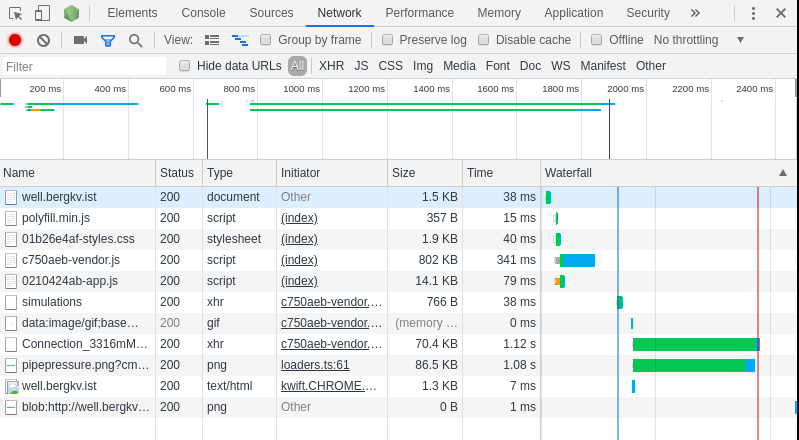
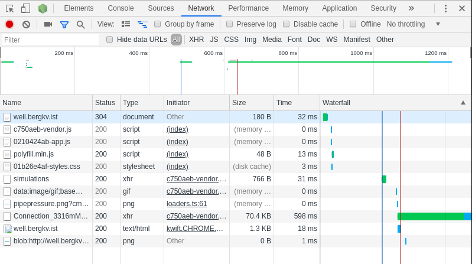
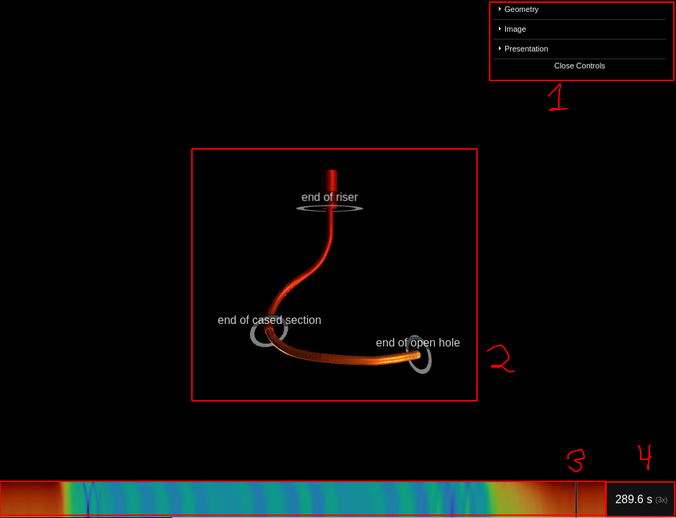

\newpage{}
\tableofcontents{}
\newpage{}

# Structure
There will be a lot of details and background material that this report does not cover. Instead, the report attempts to give a higher level and intuition-focused overview of what has been done, how the flow of ideas evolved along the way, which insights were acheived - and the resulting architecture of the final application. Only the code in its final form will be included. The code is where you should look, in case you wonder about actual implementation.

It might be a good idea for the reader to have seen/been exposed to JavaScript/TypeScript, HTML, CSS and Python. Although, the hope is that this is not absolutely neccesary.

# Introduction
## Background: The Heave Problem
When drilling from a floating rig or drilling ship, the heaving motion of the floater causes major pressure fluctuations in the well when the drill pipe is in slips during connections. Pressure fluctuations in the order of 10-20 bars have been observed in practice, sometimes giving an unacceptable risk of mud loss or kick. The only remedy for the problem is to wait for wind and waves to subside. There is a potential for saving time and cost by obtaining accurate information about downhole conditions on which to base the decision to wait or drill forward. HeaveLock has developed a simulator that predicts downhole pressure fluctuations based on weather information, response amplitude operator of the rig, well geometry, fluid properties etc. The simulator produces a large amount of data and the data needs to be visualized to the user in an easy way. In this project work, the objective is to visualize simulator data for a chosen well by developing a web-based interface.

### HeaveLock and HeaveSIM
HeaveLock is a startup in Trondheim that originally set out to create a valve to mitigate the pressure fluctuations caused by the heaving motion. On their way to acheiving this goal - they created a simulator to simulate the actual pressure fluctuations. It turned out that this tool in itself was very valuable to the oil industry - as it could predict whether it was safe to drill on any given day (given weather conditions, well geometry and fluid properties). This simulator was named HeaveSIM. HeaveSIM produces a range of output files in .txt and .csv formats. Being able to visualize the output data in an understandable and intuitive way is of importance to HeaveLock and their customers - and is the problem that this project work intends to solve. Note that HeaveSIM itself will be considered a black box - where we are only concerned with actually visualizing the input and output data, and not the implementation of HeaveSIM itself.

## Scope
The scope of this project is to create a web user interface with the following capabilities:

  * Static 3D visualization in web of well trajectory including information on:
    * Riser, casings and liners, open hole section
  * Animated 3D visualization in web or colorized visualization of a chosen simulation
    * Visualization of pressure along the annulus of the well
    * Visualization of pressure along drill string
    * Visualization of stress along drill string
  * Cross browser compatibility
    * The application should work in Internet Explorer, Edge, and mobile browsers on Android and iPhone.
  * Performance
    * The application should be performant, and provide an intuitive user experience.

# Theory
## The HeaveSIM output data
Before we start thinking about how we are going to visualize the input/output data, it is probably a good idea to try to understand the structure of this data first - and what it represents. The HeaveSIM simulator produces a range of output files - organized in a folder structure. For the simulation "Connection_4739mMD" of "Well_2", we have the following structure (which is a mix of input and output files):

`./HeaveSim simulations/Well_2/Connection_4739mMD/`

- `pipestress.csv`
- `heavevelocity.txt`
- `well_path.csv`
- `geometrydef.txt`
- `pipepressure.csv`
- `chokeopening.txt`
- `trends.csv`
- `fluiddef.txt`
- `annuluspressure.csv`
- `controldef.txt`
- `chokedef.txt`
- `pipeflow.csv`
- `pipevelocity.csv`
- `bitdef.txt`
- `annulusflow.csv`
- `mainpumprate.txt`
- `drillstringcontrol.txt`

You might be wondering what "Well_2" and "Connection_4739mMD" means. Well_2 represents the actual well - and as you might be able to guess, there is also a well called Well_1 in this data set. As for Connection_4739mMD, this represents a specific simulation point in Well_2, where a new pipe segment is in the process of being connected, while the total length of the well is 4739 meters long.

For this project, only the files `geometrydef.txt`, `fluiddef.txt`, `well_path.csv`, `pipepressure.csv`, `annuluspressure.csv`, `pipestress.csv` will be used. The first three are input files, while the last three are output files. This means the rest of the files will not be covered in this report.


### `geometrydef.txt`

The `geometrydef.txt`-file looks like the following (where the index represents the line number, starting at 0 for the first line).

Notice that we have four main sections (which we will call our geometry types) of our well. These are the riser, cased section, liner, and open section/open hole. The pipe, heavy weight drill pipe and BHA reside somewhere inside of these four sections.

| index | comment/description |
|-   |----------------|
|  0 | Well diameter in inches (open section)
|  1 | Inner riser diameter in inches
|  2 | Length of riser in meters 
|  3 | Inner casing diameter in inches
|  4 | Length of cased section in m (approximate, casing shoe set on nearest cell interface)
|  5 | Inner liner diameter in inches
|  6 | Length of lined section in m
|  7 | Pipe length in meters (total length is pipe length+bha length+heavy weight drill pipe length)
|  8 | Heavy weight drill pipe length in meters
|  9 | BHA length in meters
| 10 | Inner pipe diameter in inches
| 11 | Outer pipe diameter in inches
| 12 | Inner heavy weight drill pipe diameter in inches
| 13 | Outer heavy weight drill pipe diameter in inches
| 14 | Inner bha diameter in inches
| 15 | Outer bha diameter in inches
| 16 | Density of pipe material in kg/m^3
| 17 | Young’s modulus for pipe material in bar (<0.0: Non-elastic drill string)
| 18 | Poisson's ratio of pipe material
| 19 | Static friction factor for drag force on pipe from well wall
| 20 | Dynamic friction factor for drag force on pipe from well wall
| 21 | Weight of BHA and heavy pipe in kg
| 22 | Number of segments in riser section (riser segments must be longer than heavy weight drill pipe segments)
| 23 | Number of segments in heavy weight pipe
| 24 | Number of segments in bha
| 25 | Index at location of HeaveLock within bha (No HeaveLock=0)

### `fluiddef.txt`

| index | comment/description |
|-   |----------------|
|  0 | Mud density in kg/m^3
|  1 | Mud plastic viscosity in cP
|  2 | Mud yield point in lb/100ft^2 (Bingham plastic)
|  3 | Mud low-shear-rate yield point in lb/100ft^2 (Herschel-Bulkley)
|  4 | Mud bulk modulus in bar

### `well_path.csv`

The well path is a semicolon-separated data file, where each segment is represented by its measure depth/curve length (md), azimuth angle (azi) and inclination angle (inc). Notice that we also have a column named tvd, which is the precalculated vertical depth at the end of each segment of the well path.

The azimuth and inclination angles are in degrees, and when both are zero, the segment is pointing straight down. The md and tvd columns are in meters.

```
Md;Azi;Inc;Tvd
10;0;0;10
20;0;0;20
30;0;0;30
```

In the example above we have three segments after each other with the same length (10m) all pointing straight down.

### `pipepressure.csv`, `annuluspressure.csv` and `pipestress.csv`
These files all have the same format. They also share the same time steps and measure depths. See the example below:

```
0.0,50,150,300
0.0,0,1,2,3
0.1,1,2,3,4
0.2,2,3,4,5
0.3,3,4,5,6
```

From this data you can observe the following:

 - The time of the simulation starts at 0.0s, stops at 0.3s and has a step size of 0.1s. (The first column represents the time)
 - The simulation has data for each timestep for the measure depths 50m, 150m and 300m. (The first row represents the measure depths)
 - The simulation values in this example increase as measure depth and time increases.
 - At measure depth = 300 meters, and time = 0.3 seconds, the value is 6 bar.

A word of warning: The measure depths in these three output csv files do not match the measure depths used in the well path definition. To work around this, some kind of interpolation would be needed.

## How are we going to visualize this?
Using web browser technology that is widely available across browsers, this project work is going to create a 3D visualization of the well path, and use colors to represent the values from the simulations on each of the segments. In terms of using browser technology: this is only made possible without the use of browser plugins in recent years by something known as Web Graphics Library. [@WebGL]

WebGL is based on something called OpenGL, and allows the browser to utilize the GPU (hardware) for parallell processing. GPUs are typically what allows 3D-games with complex graphics to run smoothly on a computer or a mobile device. To get a better idea of how this can be done, we will look at how WebGL works.

### So how does WebGL work?
More specifically, WebGL is a JavaScript API for rendering high-performance and interactive graphics (both 2D and 3D) without the use of plugins in any compatible web browser. The API can be used within the HTML5 `<canvas>` elements. Recently, WebGL 2.0 was released - but since it is not yet supported by all common browsers, this project will instead be using WebGL 1.0.

To tell the GPU how to render our scene, we write something known as "shaders" in a language known as GLSL (OpenGL Shading Language). GLSL resembles a restricted version of the C programming language, but with syntactic sugar for vector and matrix operations.

The two shaders that are supported by WebGL are the vertex shader and the fragment shader. The vertex shader is a piece of code that runs on every vertex of the geometry the gpu receives, and outputs this to the fragment shader. The fragment shader then runs on every pixel of the output image - giving each its own color. Usually, 3 and 3 vertices represent a triangle - which the fragment shader is aware of when coloring pixels. If two triangles overlap, the fragment shader might run twice on the same pixel. This is why it is called a fragment shader instead of a pixel shader - since it runs once for every fragment, but can sometimes run multiple times for any given pixel. You can think of a fragment as being a single pixel on a triangle, but not neccesarily the entirety of a single pixel in the final image that is rendered.

It is possible to pass parameters to the shaders from the outside. The first type of parameter is a uniform. This is a parameter that does not change from one shader invocation to the next within any particular rendering call. The second is a vertex attribute - which is a parameter specifically linked to a vertex, meaning it changes from one vertex shader invocation to the next within a rendering call, but stays the same from one render call to the next for a specific vertex.

The WebGL API is low level - as you can only tell it what triangles to draw, and how to draw them. Imagine that you want to draw a cylinder, and have this cylinder reflect light in a certain way. This would both require a lot of JavaScript code, as well as GLSL code. Since we don't want to concern ourselves with how we can draw a cylinder using only triangles, or writing shaders for reflecting light - we will be using a 3D library that abstracts this away.

The 3D library we will be using is THREE.js. This is by far the most popular 3D library for JavaScript, with more than 59,000 stars on GitHub, 1192 contributors, and 21,000 forks at the time is is being written. [@THREE.js]

### How does THREE.js work?
To understand how THREE.js works, we need to understand the building blocks it uses to abstract away the low level API of WebGL.

#### Scene
A scene allows you to set up what is going to be rendered by THREE.js. Meshes, lights, and cameras are all "children" of a scene.

Example of creating a scene in JavaScript:
```js
import * as THREE from 'three'
const scene = new THREE.Scene()
```

#### Camera
A camera tells the renderer where the "eye" is, and what will be rendered on the canvas. Typically, a perspective camera will be used when creating a 3D-visualization.

```js
import * as THREE from 'three'
import { scene } from './some-file'
const fov = 45  // field of view in degrees
const aspect = 1.5  // aspect ratio (width / height)
const near = 0.1  // The closest distance where something will be visible
const far = 1000  // The furthest distance where something will be visible 
const camera = new THREE.PerspectiveCamera(fov, aspect, near, far)

scene.add(camera)  // Adding the camera to a scene
```

#### Renderer
The renderer tells THREE.js how to render a scene - and WebGL (WebGLRenderer) is actually not the only alternative. (Later, we will be using something called CSS2DRenderer to draw labels on top of our visualization)

```js
import * as THREE from 'three'
import { scene, camera } from './some-file'
const renderer = new THREE.WebGLRenderer({
    canvas: document.getElementsByTagName('canvas')[0]
    antialias: true,
    powerPreference: 'high-performance',
})

renderer.render(scene, camera)  // Renders a scene onto the canvas
```


#### Geometry
A geometry contains all the vertices (corners) of an object. It can also connect attributes to each of the vertices that are passed to the shaders. These could be precomputed normal vectors, colors, or uv-maps for textures. We could also define our own custom attributes if we want.

```js
import * as THREE from 'three'
const radius = 1
const height = 2
// Note that we can have different radii on the top and bottom of the cylinder.
const geometry = new THREE.CylinderBufferGeometry(radius, radius, height)
```

#### Material
The material defines which shaders will be used to render a certain geometry. Some examples of shaders are: MeshBasicMaterial, MeshStandardMaterial and RawShaderMaterial. The RawShaderMaterial allows us to write our own shaders from scratch, using GLSL.

```js
import * as THREE from 'three'
// basic material does not interact with light, and is always visible
const basicMaterial = new THREE.MeshBasicMaterial({ color: 'blue' })
// standard material has realistic reflections and is not visible without light.
const standardMaterial = new THREE.MeshStandardMaterial({ color: 'red' })
// shader material allows us to write our own shaders
const shaderMaterial = new THREE.RawShaderMaterial({
    uniforms: { time: { value: 1.0 } },
    vertexShader: '<vertex shader code here>',
    fragmentShader: '<fragment shader code here>'
})

```

#### Mesh
A mesh consists of a geometry (the vertices), and a material (the vertex and fragment shaders used to render the vertices). Essentially, one could think of a mesh as specifying what to draw (geometry), and how to draw it (material).

```js
import * as THREE from 'three'
import { scene, geometry, newGeometry, material } from './some-file'

const mesh = new THREE.Mesh(geometry, material)
scene.add(mesh) // Adding the mesh to a scene
// We can switch the geometry or material of the mesh at a later point
mesh.geometry = newGeometry
// We don't need to re-add it to the scene.
// (Since the scene only has a reference to the mesh)
```

#### Light
A light is used when rendering to create reflections or shadows based on the type of material.

```js
import * as THREE from 'three'
import { scene } from './some-file'
const color = 'white'
const intensity = 0.5
const light = new THREE.DirectionalLight(color, instensity)
scene.add(light)
```

#### Texture
A texture can be used to map an image to a surface. For example, it could be used to put the image of a brick wall on the sides of a cube. By writing our own shaders (using RawShaderMaterial), we can access individual pixels of a texture if we want. Textures are generally really performant, since no communication between the CPU and GPU is neccessary once the GPU has received the texture.

![Example of a brick wall image being applied as a texture to the sides of a cube geometry. Source: [@THREE-texture-example]](./texture-example.png){ width=256px }

#### Render Loop
This is not really specific to THREE.js animations, but to any kind of animation. A render loop is a loop that rerenders an image of the scene as often as possible up to the refresh rate of your monitor. This is also a particularily performance-critical part of the code. If you want to max out your monitor refresh rate (which most likely is 60Hz), this means you can at most use 16.67 ms to run each iteration of your render loop. (Since $1000 \text{ms} / 60 = 16.67 \text{ms}$)

## Measuring performance bottlenecks
### Render loop
Since performance is going to be a focus in this project work - we need a good way of measuring performance - to see where our bottlenecks actually are. In JavaScript, we have something called `performance.now()`, which will give us a high resolution timestamp ideal for measuring execution times. 

```js
const t = [0, 0, 0]
const maxIterations = 1000
let t0 = 0

requestAnimationFrame(() => render(0))
function render(iterationCount) {
  t0 = performance.now()
  // first instruction to measure
  t[0] += performance.now() - t0

  for (let i = 0; i < 100; i++) {
    t0 = performance.now()
    // instruction inside loop to measure
    t[1] += performance.now() - t0

    t0 = performance.now()
    // another instruction inside loop to measure
    t[2] += performance.now() - t0
  }

  if (iterationCount >= maxIterations) {
    // Stops rendering and prints the timing results
    console.log(t)
  } else {
    requestAnimationFrame(() => render(iterationCount + 1))
  }
}
```

Using this method, we are able to tell which lines of code in our render loop are taking the most time to execute. Rather than trying to randomly guess what needs to be optimized, this method gives us a clear answer of what the slowest part is. Although this method is not specifically mentioned later in the report - the actions taken when improving performance is based on measurement results from this method.

### Load time
Another important aspect of performance is the load time of the application. This is measured using the waterfall view in the Network Tab in Google Chrome DevTools [@DevTools]. Below are two examples (screenshots) from loading the finished website two times in a row:

{ width=256 }
{ width=256 }

Notice that the second time, the application loads almost twice as fast. This is because the application is utilizing the built-in caching behaviour in browsers. [@Caching] Optimizing the application for caching will improve second-time loads of the page. Minimizing the file sizes that are transferred will reduce the load times.

The application is being hosted on a virtual machine located in Amsterdam using the cloud provider DigitalOcean. The virtual machine has a 25GB SSD, 2GB of RAM, and a single (shared) CPU core available. All of the requests are made from Trondheim in Norway.

\newpage{}
# Implementation
## Algorithm: Turning the well path into cylinders
To represent the well path, we are going to draw one cylinder for each segment.

{ width=256px }

We define a cylinder to have the following properties:

| name     | description |
|----------|-------------|
| $posx$   | Position of cylinder centre (x-coord) |
| $posy$   | Position of cylinder centre (y-coord) |
| $posz$   | Position of cylinder centre (z-coord) |
| $rotx$   | Euler angle (X) in radians |
| $roty$   | Euler angle (Y) in radians |
| $rotz$   | Euler angle (Z) in radians | 
| $radius$ | Radius of the drawn cylinder |
| $length$ | Length of the drawn cylinder |


From our `well_path.csv`, we have the following columns of interest:

| name     | description |
|----------|-------------|
| $md$     | Measure depth at the end of segment (cummulative "curve length") |
| $azi$    | azimuth angle of the segment (relative to world frame) in degrees |
| $inc$    | inclination angle of the segment (relative to world frame) in degrees |

Let $col[n]$ denote the value at the n'th row in the column "col" of the csv file (the first row is $n=0$)

The length of a segment should simply be the change in measure depth between the current and previous segment (since we define measure depth to be the curve length up to the end of the current segment)
$$length[n]:=md[n]-md[n-1]$$

Where we assume that $md[-1]:=0$.

The azimuth angle is our y-rotation, and the inclination angle is our z-rotation. We need to make sure the rotations are in radians and not degrees. Also, note that we assume $\vec{-\hat y}=(0, -1, 0)^T$ to be the direction when all angles are zero. (A pipe that is not rotated will point straight down)
$$\begin{pmatrix}
rotx[n]\\
roty[n]\\
rotz[n]
\end{pmatrix}:=\begin{pmatrix}
0\\
\text{radians}(azi[n])\\
\text{radians}(inc[n])
\end{pmatrix}$$

As an intermediate step in finding the positions, we will create a vector for each segment. This vector will point from the start of the segment to the end of it. The vector without any rotations would then be $(0, -length[n], 0)^T$. After applying rotations (using rotation matrices), we get the following:

$$
\vec{vec}[n]:=
\overbrace{
\begin{pmatrix}
\cos (roty[n]) & 0 & \sin (roty[n])\\
0 & 1 & 0\\
-\sin (roty[n]) & 0 & \cos (roty[n])
\end{pmatrix}}^{\vec{R_y}(roty[n])} \cdot \overbrace{\begin{pmatrix}
\cos (rotz[n]) & -\sin (rotz[n]) & 0 \\
\sin (rotz[n]) & \cos (rotz[n]) & 0\\
0 & 0 & 1
\end{pmatrix}}^{\vec{R_z}(rotz[n])} \cdot \overbrace{\begin{pmatrix}
0\\
-length[n]\\
0
\end{pmatrix}}^{length[n]\cdot (\vec{-\hat y})}
$$

Taking the cummulative sum of the segment vectors up until the current segment will give you a position vector that points from the start of the entire well path to the end of the current segment. To get to the centre of the current segment, we can then backtrack by half of the vector for the current segment. 

$$
\begin{pmatrix}
posx[n]\\
posy[n]\\
posz[n]
\end{pmatrix}:=\left(\sum_{k=0}^{n}{ \vec{vec}[k] }\right) - \frac{1}{2}\vec{vec}[n] 
$$

You may now have noticed that we have every cylinder property wee need, except for one (the radius). The problem we are now faced with is that nothing in `well_path.csv` can tell us what the radius for a specific segment is supposed to be. To figure out this, we have to look at `geometrydef.txt` (which defines the different types of segments).

## Algorithm: Finding the cylinder radiuses/geometry types
Let $g[n]$ represent the value at index/line number n according to the geometrydef.txt from the introduction. Let $\text{from\_inches}(x)$ be a function that converts $x$ from inches to meters. Note that the riser is considered to be part of the cased section (which means that "length of cased section" includes the length of the riser). We will differentiate the riser from the rest of the cased section since they have different radii.

From this, we define our geometry types:

| name          | radius | md_start | md_stop |
|---------------|--------|----------|---------|
| riser         | $0.5 \cdot \text{from\_inches}(g[1])$ | 0 | $g[2]$
| cased section | $0.5 \cdot \text{from\_inches}(g[3])$ | $g[2]$ | $g[4]$
| liner         | $0.5 \cdot \text{from\_inches}(g[5])$ | $g[4]$ | $g[4]+g[6]$
| open hole     | $0.5 \cdot \text{from\_inches}(g[0])$ | $g[4]$ + $g[6]$ | $g[7]+g[8]+g[9]$

Using this table, it is now possible to set the radius of the cylinders that was missing in the previous section. Let the function $\text{geometry\_radius}(md)$ return the radius from the geometry type table above for which $\text{md\_start} < md \leq \text{md\_stop}$. If no entry matches, return 0.

$$
radius[n] := \text{geometry\_radius}(md[n])
$$

Now that we have all our path segment properties for creating cylinders, let's create them in THREE.js and render them.

## Rendering the well path with THREE.js
Using real-life lengths and radiuses make the pipe appear incredibly thin and long. This is not good for visualization purposes, since the path and the color of the cylinders are very hard if not impossible to see from far away.

{ height=128px }
{ height=128px }

To solve this problem, we multiply the radius by a factor of 100 for all of the segments, and move a little backwards. The entire well path is now clearly visible at the same time, as you can see in the second picture. In total, around 1700 cylinders are rendered in the pictures above.

Now, this is all well and good - but how can we color each segment independently according the simulation data? Let's start by loading `pipepressure.csv` into the application.

## Coloring the individual segments based on data
The `pipepressure.csv` for the well path you see in the image above is around 8MB in size - and this means it takes at least 8 seconds to load over a 8Mbit/s connection. That's a lot of data for a website to load at one time. It has around 2700 timesteps and 160 different measure depths. Notice that this is only around a tenth as many measure depths as our well path has. Before trying to optimize anything related to this, let's at the very least try to get it working.

To start off, we find the min and max values of the simulation data for every cylinder we want to draw. Then we can create a function that takes in time for each of the segments, and outputs a color relative to the min and max values for that cylinder. This should allow us to see that every cylinder is changing color

For every iteration of the render loop, we then compute the 1700 colors and set them on the material (sending them to the GPU).

This works, but the performance is not great, at less than 20 frames per second. Both on mobile and desktop. It is expensive to compute the colors for every iteration. It is also expensive to send a lot of data to the GPU often in the main render loop. If we want to acheive 60 frames per second (which is what most monitors can display), it means that every iteration of the render loop can only take at most 16.67 ms to run.

So how could we reduce the amount of time spent in each iteration of the main render loop? What about precomputing all of the colors, into a 2 dimensional array of the color values? Each field would then contain the color as a hexadecimal string.

## Precomputing colors of the segments
Good, and bad news. Let's start with the good news. After precomputing all of the colors as hexadecimal strings, the performance doubles to almost 40 frames per second on my laptop - even though we still have to send 1700 colors to the gpu every frame.

When it comes to the bad news:
Although it improves the framerate once precomputed, it takes around half a minute to do so. In other words, this is not acceptable. On mobile it doesn't work at all - it keeps on precomputing until it crashes, because it runs out of memory.

Let's do some calculations and find a lower limit for how much memory this uses:
One character in javascript uses 2 bytes. A color on hexadecimal form (example: `'#ff0000'`) is 7 characters. We have precomputed 2700 color strings for each of the total 1700 cylinders. This means we are now at around 
$$2\text{B}\cdot7\cdot2700\cdot1700=64\text{MB}$$

64MB of data should not be crashing a mobile browser. (although it is still a mouthful for a mobile browser to deal with) This must mean that our first attempt at this was rather inefficient. Maybe there is a way to do this more efficiently.

But wait - we are trying to precompute a 2-dimensional array of colors? Isn't there another name for this? This is also known as **an image**, right? 

## Precomputing an image
Using python 3 with the libraries pandas, and matplotlib, it is relatively easy to load the csv for the simulation into memory, and save it as a heatmap image. Notice that we transpose the image, just because we want the time axis to be horizontal, and measure depth to be vertical, as this feels more intuitive.

```py
import pandas as pd
import matplotlib.pyplot as plt
pipepressure = pd.read_csv('./pipepressure.csv', index_col=0)
plt.imsave('./pipepressure.png', pipepressure.transpose())
```


This looks pretty interesting already - but that gradient from the top conceals the fluctuations we are interested in. To remove the gradient, we will use the Md and Tvd-columns of `well_path.csv` to find the relationship between measure depth and vertical depth, along with the mud density from `fluiddef.txt` to remove the gravity related component of the pressure. This gives us:


And guess what, this operation took less than a second. The resulting image is around 100kB in size. Compared to pipepressure.csv, this is an 80x reduction in size! How is this even possible? Most likely due to lossless image compression along with a much more compact format than storing numbers as text. Image compression is something that has likely been worked on a lot, which we can reap the benefits of here.

This means that first of all, we might no longer need to load 8MB of data, and secondly, we don't need to wait half a minute on a laptop/crash the mobile browser due to running out of memory. It seems that a lot of problems are going to be solved. The next step now is to read the image in to the client.

## Loading the image in to the client
We already discussed how iterating over all of the segments and sending 1700 colors to the gpu on every frame affected performance. Now that we have an image, we should be able to transfer this to the GPU as a texture, and perform the pixel lookups on the image from within the GPU! For this we would have to write our own GLSL shaders (using RawShaderMaterial in THREE.js).

Something else that has been affecting performance (which was not mentioned previously) is the fact that we have 1700 meshes in our scene, which the renderer has to iterate over for every frame on the cpu. To fix this, we will merge all the cylinder geometries into a single geometry. To differentiate between the cylinders (from within the GPU), we then give all the vertices in each cylinder a vertex attribute, to tell us which measure depth it represents. Or even better, we just tell it which row of the image/texture it represents.

We will then also give the current time as the image column (using a uniform) to the shader material we will be applying on the entire geometry.

This means that every vertex now has both a texture column and a texture row to look at - yielding a single pixel. One single color for each vertex. Since each cylinder shares the same image row, all its vertices will have the same color. 

To sum up, the following will determine the color of each cylinder:

 - A texture created from the pregenerated image (accessible from all the vertex shaders)
 - An image row (vertex attribute) that was assigned to all the vertices of each cylinder
 - An image column (uniform passed to all vertex shaders). 

As previously mentioned, however - it would be ideal not to have to write our own shaders from scratch (with light reflections and everything). Turns out we are in luck, since there exists a library called THREE.BAS. [@THREE.BAS]

### What is THREE.BAS?
THREE.BAS (THREE Buffer Animation System) is a library that allows us to reuse the materials in THREE.js, while injecting our own shader code snippets in a relatively clean way. This means we only need to write the shader code for the exact logic we need - while we are able to reuse the rest of the shader code that THREE.js already wrote for us - except we now control the color from the inside of the gpu instead of the outside. Essentially, we don't need to use RawShaderMaterial directly after all.

### What happens to performance now?
First we compute the imageRow for every cylinder geometry, and set this as a buffer attribute on every vertex in the cylinder. Next, all the cylinders are merged together into a single geometry (carrying over their attributes).

This geometry is combined with a custom `THREE.BAS`-material to pick color based on imageRow (attribute) and imageColumn (uniform). In the main render loop, we change the imageColumn uniform of the material for every time step. Instead of sending 1700 colors every time step, we now only send one number: the imageColumn. It is unlikely that it is possible to reduce the amount of data sent between the cpu and gpu each timestep by more than this.

The result is 60 fps on both mobile and desktop. The frame rate is at the maximum the monitor can provide. It was possible - and even quite elegant to acheive. Exactly how the imageRow is computed might be of interest - so this will be discussed in the next section.

## Algorithm: Computing imageRow for each cylinder

The first thing to realize is when reading a texture in WebGL, the image dimensions are considered to be 1x1, and you use floating point decimals to specify the row or column. This means that row=0.5, column=0.5 is in the middle of the texture, while row=1.1, column=0.5 is outside of the texture.

To compute the imageRow for each cylinder, we need to look at both `well_path.csv` and `pipepressure.csv`. Why? The image itself is generated from `pipepressure.csv`, so the pixels in the vertical direction corresponds to the measure depths that were used in the simulation. While each cylinder corresponds to the measure depths from `well_path.csv`.

Consider the following example:

| measure depths from `pipepressure.csv` | imageRow |
|---:|---|
|   50 | 0.00
|  150 | 0.25
|  300 | 0.50
|  400 | 0.75
|  500 | 1.00

We now want to define a function $\text{md\_to\_image\_row}(md[n])$ which takes a measure depth, and returns an imageRow.
When we input md=75, we want the ouput to be 0.125. If we input 350, we want the ouput to be 0.625. This means md_to_image_row will be a linear interpolation between the measure depths, and a linear space of equally distributed values between 0 and 1.

We can apply this function to every measure depth in the `well_path.csv`-file to give each cylinder an imageRow:

$$
imageRow[n] := \text{md\_to\_image\_row}(md[n])
$$

This could lead to a cylinder receiving either a negative imageRow, or one greater than 1.0. This is not a problem, as we will simply color these cylinders grey in the THREE.BAS material (assuming they exist in the first place)

It seems like we still need to load `pipepressure.csv` into the browser to do what we want - or do we?

## Creating a Python HTTP-API.
To avoid sending unneccesary data to the client, we will create a Python API - which will be responsible for generating images dynamically/on demand (as previously seen), as well as creating and returning a list of the cylinder data structures, which in their final form have the following properties:

| name     | description |
|----------|-------------|
| $posx$   | Position of cylinder centre (x-coord) |
| $posy$   | Position of cylinder centre (y-coord) |
| $posz$   | Position of cylinder centre (z-coord) |
| $rotx$   | Euler angle (X) in radians |
| $roty$   | Euler angle (Y) in radians |
| $rotz$   | Euler angle (Z) in radians | 
| $radius$ | Radius of the drawn cylinder |
| $length$ | Length of the drawn cylinder |
| $imageRow$ | Row of the generated image to access in the vertex shader |

Doing this means that all of the "hard work"/most of the algorithms are offloaded to the server, and only the bare minimum data needed for visualization needs to be loaded by the client. Another advantage is that the API can be protected by a password - to prevent unrestricted access to data.

Along with the API, we also create a reverse proxy, which routes any url paths starting with /api, and /docs to the Python API instead of to the client resources (such as index.html, css files and javascript bundles). This is to avoid thinking about Cross Origin Resource Sharing (CORS), which can be its own adventure. [@CORS]

At last we have finally met our performance goals. Having both a high framerate, and a low load-time for our application. The client is still loading several hundred kB of data. It is likely that it would be possible to reduce this even more - using a more compact packing format for the geometry data.


## Additional functionality
### An interactive timeline displaying the image
At the bottom of the application, we will create an interactive timeline - which will display both the current time, allow for changing the time - as well display the image being projected onto the cylinders.

### Casing Shoes
At the end of each geometry type, we have what is known as a casing shoe. These are visualized as rings in the client - along with labels. The idea is to make it clear where these transitions happen - as the change in radius of the segments might not be big enough to be noticable. The labels are also useful in showing what the actual sections are called.

### A GUI Config Panel
Using the JavaScript library `dat.gui` [@DAT.GUI], we are able to create a GUI panel in the application where you can do things like select well and connection for a simulation, set the thresholds used for generating an image, show or hide the casing shoes/labels, an fps counter.

### Cross-Browser compatibility
A lot of work has been put in to making the application work in as many browsers as possible. This includes browsers such as Google Chrome, Mozilla Firefox, Mobile Browsers (iOS and Android), Internet Explorer 11 and Microsoft Edge.

Some of the steps taken to ensure this is the following

#### Transpilation
JavaScript code is "transpiled" to an older version of the JavaScript standard. That is - its syntax is transformed to a less elegant, but older version of the language that is supported by more browsers. The transpilation step is performed using the bundler "FuseBox v4" in this project. [@FuseBox] FuseBox also "minifies" the code - renaming variables to shorter names and removing all whitespace. This is a common step for minimizing the amount of data the browser has to load.

#### Polyfills
Although you can transpile the syntax to an older version, this isn't always enough. When a new feature has been added to JavaScript and you are using it - you will need to include a "polyfill" for this feature. This means you include an implementation of the feature in the older standard - which can be used in case the browser has not implemented the more recent feature.

Even though you make sure to transpile and include polyfills for all the features you are using, this is usually not enough - and ultimately, physically or automatically testing in each of the browsers is the best way of figuring out if it works or not.

To give an example - the WebGL implementation on iOS has a maximum texture size of 4096x4096. Breaking this limit simply causes the texture to become entirely black within WebGL. Having a texture of size 73x4320 means it will work in Google Chrome on your laptop - but just be entirely black on your phone. Source: Error messages and testing

#### Touch vs Mouse
Touch displays are also different than mouse controls - and should be tested as well. For example: to enhance range inputs on touch displays (used for the timeline), a library called rangetouch was used. [@RangeTouch]

#### Stylesheets
The different browsers usually all have their own default styles, which might need to be reset - or even set in different ways for different browsers. An example of this is the view-height problem on mobile devices. [@ViewportMobile] Or the styling of the range input. [@RangeInputStyle]

## The final architecture
The result is a client- server architecture:


The available API endpoints are:

- `/api/`
  - Does not require authentication. Will display a welcome message. Useful for checking if the API is running.

- `/api/simulations`
  - Returns an object of available wells and connections as JSON.

- `/api/simulations/{well}`
  - Returns a list of the available connections for a specific well as JSON.

- `/api/simulations/{well}/{connection}`
  - Returns the geometry for a specific well or simulation as JSON. This includes casing shoes, simulation start/stop time, and the centre point of the entire geoemtry (used for centering the camera).

- `/api/simulations/{well}/{connection}/pipepressure.png`

- `/api/simulations/{well}/{connection}/annuluspressure.png`

- `/api/simulations/{well}/{connection}/pipestress.png`
  - These three all return images that are mapped onto the geometry and displayed on the timeline. Here you can also pass query parameters like `vmin`, `vmax` and `cmap` to specify thresholds and colormap in the url.

You can also access the autogenerated documentation for this at the url path `/docs` in the application.

# User Guide
When opening the web application the first time - you will be asked for an API key/a password. This prompt will keep appearing until you have successfully authenticated with the API. After this, the key will be stored as a cookie in your browser - so that you won't need to enter it again the next time you open the website. See the first picture below.

{ height=220px }
{ height=220px }

Notice that there are 4 different GUI elements available in the second picture above. 

1. is the control panel. Clicking each of the folders will cause them to expand, revealing configuration options for what will be displayed. 

2. is the actual 3D-visualization. The controls are as follows:

|action|using mouse|using touch display on phone|
|-|-|-|
|zoom  | use mouse wheel      | pinch with two fingers
|rotate| left click and drag  | drag with one finger
|pan   | right click and drag | drag with two fingers

3. is the timeline, as well as a 2D visualization of the simulation output (in the form of a heatmap). The cursor shows which column of the image is currently being displayed/drawn onto the 3D-figure. Note that in some browsers, the cursor will be lagging behind what is actually drawn. This seems to work the best in mobile browsers or Google Chrome. Note that you can click on the timeline or drag the cursor to where you want it to be.

4. displays the current time as well as the current time speedup in parenthesis This is also a button which will play/pause the animation. When playing, the button is gray - but when paused, it switches to a dark red color (maroon).

{ height=256px }

The configuration menu in the picture above has a few different settings:

 - **well** decides which well to visualize in the 3D-view.

 - **connection** decides which simulation point (drilling depth/connection) to visualize for a specific well. The higher the number in the connection name, the longer the drawn path will be. It is called connection, because this is when the pipe is being held fastened to the platform in order to connect a new pipe segment.
 
 - **radiusScaling** decides which multiplier to use for the radius. A higher value will make the well path appear thicker. A lower value will make the well path appear thinner. This requires refetching from the API, since the API carries out these multiplications.
 
 - **simulation** decides which of the output csv files to visualize along the well path and in the timeline for a specific well and connection.
 
 - **colormap** decides which color sequence will be used to represent the different values in the simulation data.
 
 - **customThresholds** allows the user to specify custom min and max values that are used when coloring the resulting image. If this is turned off, the min and max values of the data itself will be used. Turning it on will reveal two more inputs (vmin and vmax) which represent the custom min and max values that will be used.

 - **reflectiveSurface** will allow you to turn on or off the light reflections in the visualization. The light can help you get a better spatial feel of the well geometry, but will make the colors less clear. Turning the reflectiveSurface off can be good if you want a more precise view of the colors.

 - **showCasingShoes** will show the rings and labels at the bottom of each geometry type of the well. These rings and labels can be turned off, so that you only see the well itself. This can also be useful, along with turning reflectiveSurface off when you want to get a clear view of how the colors are changing.

 - **showFps** will display an FPS-counter in the corner. This doesn't really add anything to the visualization, other than the ability to debug potential performance problems.

 - **timelineSpeedup** allows you to speed up the playback speed of the animation/cursor on the timeline. It can sometimes be difficult to notice changes that happen very slowly. That's why this option exists, so that you can make the slow changes appear less slow.


# Conclusion and Further work
The goal of this project was to create a dynamic 3D visualization for the output of HeaveSIM. The idea was to be able to discover whether it is safe to drill on any given day based on weather conditions - and if not, where along the well path the problems would arise.

Using a Python backend API, along with a frontend written in TypeScript [@TypeScript] - with THREE.js, an application able to visualize the well path in 3D, with dynamic colors was created.

With the application it is possible to successfully track pressure waves as they propagate down the well path - and set custom margins to detect if the fluctuations are too big. It also visualizes the fluctuations in 2D - using a heatmap image.

The application has also been deployed to a virtual machine in the cloud - protected behind an API key (available as a demo). It works across multiple web browsers, including Internet Explorer, Microsoft Edge, Safari on iOS, Google Chrome on Android as well as Google Chrome and Firefox on desktop computers. It does so with good performance - reaching 60 frames per second while animating the colors and rotating.

The resulting application should be able to save oil companies a lot of money - since they now can insert the current weather conditions into HeaveSIM, and see in 3D how the pressure changes along the well path. This can tell the oil company whether they can start drilling, or need to wait for waves and weather conditions to subside - with lower margins than previously possible.


While the application already has a lot of features and functionality, there is still a lot of room for improvement. A list of points to concider for further work on this project are:

- The ability to remember configuration using browser storage/cookies

- Showing a colorbar on the side to inform the user of which values the colors actually represent

- A transparent visualization - showing the pipe, heavy weight drill pipe and BHA inside of the well path.

- Using https (SSL encrypted traffic) for the deployment. This would be added to the proxy configuration.

- Set up continous deployment from a GitHub repository: Whenver changes are made to the code, the server will automatically download the new code and restart.

- Currently, when switching well or image too quickly - a race condition can occur. This can be fixed by cancelling the previous request/ignoring the reply if a new one is made.

- The range input used for the timeline has some performance problems with updating the thumb/cursor very often in some browsers. This could be further investegated and hopefully fixed.


# Abbreviations and terms
## Abbreviations

- API - Application Programming Interface
- HTML - HyperText Markup Language
- CSS - Cascading Style Sheets
- URL - Uniform Resource Locator
- CPU - Central Processing Unit
- GPU - Graphics Processing Unit
- JSON - JavaScript Object Notation
- JS - JavaScript
- TS - TypeScript
- WebGL - Web Graphics Library
- IE11 - Internet Explorer 11 (Web browser by Microsoft)
- csv - Comma Separated Values (file format)

## Terms
 - Transpilation: The act of transforming the syntax of code from one version of the language to another.

 - Polyfills: Code snippets that insert newer functionality that has not yet been implemented in an older version of the language.

 - Bundler: A piece of software that bundles dependencies together, and packages them in an efficient format to serve to a client. A bundler will often also perform transpilation for you.

 - Syntatcic Sugar: Syntax within a language designed to make things easier to read or express.

 - Reverse proxy: A server that receives requests, and forwards them somewhere else. The requests can be filtered and sent to different places based on things like the url path, or the hostname.

 - Cross Origin Resource Sharing (CORS): Modern browsers have implemented a security policy to make it harder for a website to access data from other websites without the permission of that other website/server. The server has to explicity tell the browser that a specific website is allowed to read its response.


# Picking a 3D library for JavaScript

Selection criteria:

* **Ability to create custom 3D-visualizations** - The tool must be capable of creating an interactive 3D-visualization.
* **Documentation/Community support** - How well documented is the code, and how "well trodden" is the choice in general?
* **Performance** - Is it possible to acheive a high monitor refresh rate of the scene without consuming a lot of system resources?
* **Accessibility** - How wide is the browser support Is it supported on Internet Explorer 11 as well as mobile browsers?
* **Price** - There must be a free alternative. Entirely open-source is preferrable.

\newpage{}

## Alternatives for WebGL libraries

| Name           | Unity3D for Web [@Unity3D] |
|----------------|-----------------|
| Description    | Game engine. Compiles C# to produce WASM and WebGL-code.
| 3D-capabilites | Yes
| Community      | Possible to receive commercial support.
| Performance    | Most likely good (I didn't manage to find any open examples/demos).
| Accessibility  | Mobile browsers are not supported. Neither is IE11.
| Price          | Commerical: Free personal, $99 professional

| Name           | d3.js [@d3.js] |
|----------------|-------------------------------|
| Description    | JavaScript library for data visualization.
| 3D-capabilites | Lacking by default. Need to combine it with a third party library.
| Community      | 89k stars on GitHub. 122 contributors. 21k forks.
| Performance    | Good
| Accessibility  | Not a problem
| Price          | Open-source/free

| Name           | THREE.js: [@THREE.js] |
|----------------|----------|
| Description    | JavaScript 3D library.
| 3D-capabilites | Yes
| Community      | 57k stars on Github. 1,192 contributors. 21k forks.
| Performance    | Good
| Accessibility  | Not a problem
| Price          | Open-source/free

| Name           | Babylon.js [@Babylon.js] |
|----------------|------------|
| Description    | A JavaScript framework for creating 3D-games.
| 3D-capabilites | Yes
| Community      | 10k stars on Github. 257 contributors. 2k forks.
| Performance    | Good
| Accessibility  | Not a problem
| Price          | Open-source/free


## The choice: THREE.js
Based on the selection criteria - it is clear that THREE.js scores highest on all counts, and will therefore be the tool of choice for this project. THREE.js also seems to provide better performance than Babylon.js [@THREEvsBabylon]

# References
